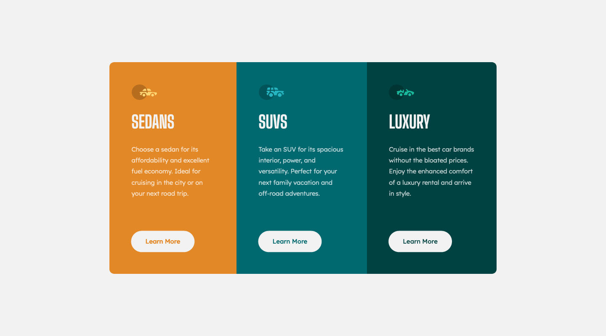

# Frontend Mentor - 3-column preview card component solution

This is a solution to the [3-column preview card component challenge on Frontend Mentor](https://www.frontendmentor.io/challenges/3column-preview-card-component-pH92eAR2-). Frontend Mentor challenges help you improve your coding skills by building realistic projects. 

## Table of contents

- [Overview](#overview)
  - [The challenge](#the-challenge)
  - [Screenshot](#screenshot)
  - [Links](#links)
- [My process](#my-process)
  - [Built with](#built-with)
  - [What I learned](#what-i-learned)
  - [Continued development](#continued-development)
- [Author](#author)

## Overview

### The challenge

Users should be able to:

- View the optimal layout depending on their device's screen size
- See hover states for interactive elements

### Screenshot

#### Desktop

_(1440×800px)_

#### Mobile

_(375×800px)_

### Links

- [Solution Repository URL](https://github.com/hyde-brendan/hyde-brendan.github.io/tree/main/frontend-mentor/3-column-preview-card-component)
- [Live Site URL](https://hyde-brendan.github.io/frontend-mentor/3-column-preview-card-component/index)

## My process

### Built with

- CSS custom properties
- Flexbox
- Mobile-first workflow=

### What I learned

Had a fun time playing around with the properties of flexboxes in this project, as well as how to fix certain issues faced. For example, initially when starting the desktop view, the buttons on the three cards were not vertically aligned due to the differing line amounts from the description above. As these were not grids, I couldn't slap on something like a `align-self: end` to fix it. I ended up learning about how `margin-top: auto;` could be used to force the element to the bottom of its section in order to fix it.

### Continued development

I'm unsure about when it would be best to set the media query to swap `flex-direction`. I set it to a value where the final card on desktop view started to have its width warped as to prevent details getting cut off, but the resulting view is quite empty. A tablet view between would help presumably.

## Author

- Frontend Mentor - [@hyde-brendan](https://www.frontendmentor.io/profile/hyde-brendan)
