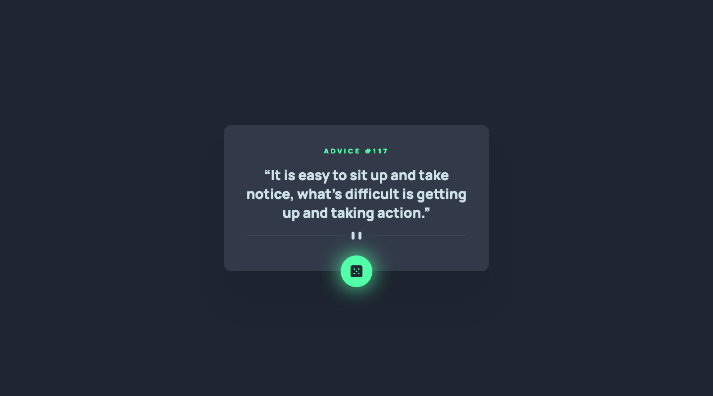
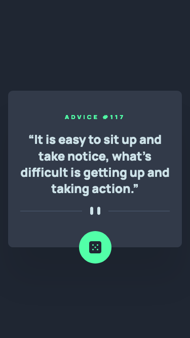

# Frontend Mentor - Advice generator app solution

This is a solution to the [Advice generator app challenge on Frontend Mentor](https://www.frontendmentor.io/challenges/advice-generator-app-QdUG-13db). Frontend Mentor challenges help you improve your coding skills by building realistic projects.

## Table of contents

- [Overview](#overview)
  - [The challenge](#the-challenge)
  - [Screenshot](#screenshot)
  - [Links](#links)
- [My process](#my-process)
  - [Built with](#built-with)
  - [What I learned](#what-i-learned)
  - [Continued development](#continued-development)
  - [Useful resources](#useful-resources)
- [Author](#author)

## Overview

### The challenge

Users should be able to:

- View the optimal layout for the app depending on their device's screen size
- See hover states for all interactive elements on the page
- Generate a new piece of advice by clicking the dice icon

### Screenshot

#### Desktop



_(1440×800px)_

#### Mobile


_(375×667px)_

### Links

- [Solution Repository URL](https://github.com/hyde-brendan/hyde-brendan.github.io/tree/main/frontend-mentor/advice-generator-app)
- [Live Site URL](https://hyde-brendan.github.io/frontend-mentor/advice-generator-app/index)

## My process

### Built with

- Semantic HTML5 markup
- CSS custom properties
- Mobile-first workflow

### What I learned

It's been a few days since my last Frontend Mentor challenge, and in that period I had to do a 48-hour front-end project for a company I was applying for. The project was quite a step up in complexity than the usual Frontend Mentor challenge I've done thus far, but I did learn a few new things from it.

One of the requirements of the 48-hour project was to follow the [Airbnb JavaScript Style Guide](https://github.com/airbnb/javascript) (with some personal omissions, like the questionable "use single quotes instead of double quotes for strings"), and I've made an effort to use some of the guidelines for the `index.js` script in this solution.

Regarding the actual challenge itself, this involved the usage of an external API, the [Advice Slip JSON API](https://api.adviceslip.com/). Since I've already been using [`fetch()`](https://developer.mozilla.org/en-US/docs/Web/API/fetch) for the reading and rendering of the cards on the [main landing page](https://hyde-brendan.github.io/), I was already decently familiar with using the method for obtaining the slip object response. Instead of using the ["Random advice" endpoint](https://api.adviceslip.com/#endpoint-random), I opted to instead draw a random value within the API's valid range and use the ["Advice by ID" endpoint](https://api.adviceslip.com/#endpoint-id), as this would ensure a random advice with each reroll. I do wish the API naturally included a way to check the range of valid IDs though, as I had to manually check the minimum and maximum values:
```javascript
const idMin = 1;
const idMax = 224;
const randId = Math.floor(Math.random() * (idMax - idMin) + idMin);

fetch(`https://api.adviceslip.com/advice/${randId}`)
    .then((response) => response.json())
    .then((data) => {
        renderAdvice(data.slip.id, data.slip.advice);
    })
    .catch((error) => {
        console.error(`Error: ${error}`);
    });
```

Since just having the new advice appear didn't look particularly nice, I also experimented with creating a typewriter effect function for writing out the new advices. As I understand it, it's a recursive function that sets the advice text element's `innerHTML` to a subscript of the message between 0 and `typewriterIndex`. After, the value of `typewriterIndex` is incremented, and calls itself (with a longer `innerHTML` substring result) until the ending condition of the `typewriterIndex` being larger than the length of the advice string. To call itself, [`setTimeout()`](https://developer.mozilla.org/en-US/docs/Web/API/setTimeout) is able to asynchronously call the provided function after a provided delay. There's some issues with it when you mash the reroll button (I'll talk more about that below), but other than that it works like a charm:
```javascript
typewriterText = data.slip.text;
typewriterTextLength = typewriterText.length;
typewriterIndex = 0;
typewriter();

function typewriter() {
    adviceTextEl.innerHTML = typewriterText.substring(0, typewriterIndex);
    typewriterIndex += 1;
    if (typewriterIndex < typewriterTextLength) {
        setTimeout("typewriter()", typewriterSpeed);
    }
}
```

This challenge was definitely more of a JavaScript-focused one, as I don't have really anything to discuss on the HTML or CSS side of it. The only thing I tried out that was new was the `:hover` effect for the die button; it used a combination of a pseudo element and the [`filter: blur()`](https://developer.mozilla.org/en-US/docs/Web/CSS/filter-function/blur()) effect. This effect could've also been done with [`box-shadow`](https://developer.mozilla.org/en-US/docs/Web/CSS/box-shadow), but I've heard before that animations regarding `box-shadow` are one of the most resource-intensive things you can do on a webpage, so I didn't really want to do that. Instead, the pseudo element's opacity is the one that changes, which *should* be much less resource-intensive.

### Continued development

As mentioned above, the typewriter effect goes wonky if you call for a new advice slip before the typewriter animation for the previous slip's message fully finishes: the new message will fill out twice as fast. From what I understood when looking it up, because `setTimeout()` is asynchronous, the process does not cancel when the reroll button is pressed again. As such, multiple instances of the `typewriter()` function run at the same time, and `typewriterIndex` increases faster than normal, resulting in the faster typing. I read about things you can do like promises, but at my current level I'm unsure how to work with those without also forcing the entire typewriter animation to end before the user can press the die button again.

### Useful resources

- [MDN Web Docs' page on using fetch()](https://developer.mozilla.org/en-US/docs/Web/API/Fetch_API/Using_Fetch) - A more easy-to-understand guide to how the `fetch()` method works with examples.
- [CSS Tricks' post on the typewritter effect](https://css-tricks.com/snippets/css/typewriter-effect/) - I was using the [third CodePen](https://codepen.io/gavra/pen/nNRvKX) under the "More" section as my main reference for this solution's typewriter effect.

## Author

- Frontend Mentor - [@hyde-brendan](https://www.frontendmentor.io/profile/hyde-brendan)