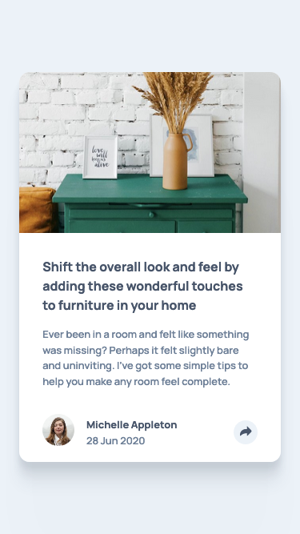

# Frontend Mentor - Article preview component solution

This is a solution to the [Article preview component challenge on Frontend Mentor](https://www.frontendmentor.io/challenges/article-preview-component-dYBN_pYFT). Frontend Mentor challenges help you improve your coding skills by building realistic projects. 

## Table of contents

- [Overview](#overview)
  - [The challenge](#the-challenge)
  - [Screenshot](#screenshot)
  - [Links](#links)
- [My process](#my-process)
  - [Built with](#built-with)
  - [What I learned](#what-i-learned)
  - [Continued development](#continued-development)
  - [Useful resources](#useful-resources)
- [Author](#author)

## Overview

### The challenge

Users should be able to:

- View the optimal layout for the component depending on their device's screen size
- See the social media share links when they click the share icon

### Screenshot

#### Desktop


_(1440×800px)_

#### Mobile



_(375×667px)_

### Links

- [Solution Repository URL](https://github.com/hyde-brendan/hyde-brendan.github.io/tree/main/frontend-mentor/article-preview-component)
- [Live Site URL](https://hyde-brendan.github.io/frontend-mentor/article-preview-component/index)

## My process

### Built with

- Semantic HTML5 markup
- CSS custom properties
- Flexbox & CSS Grid
- Mobile-first workflow

### What I learned

This project was my first experience creating a popup tooltip, and I was having quite a bit of trouble fine-tuning it.

The first question I had to answer was: where should the active state information be placed in the HTML? Initially I tried setting it as a separate grid element that would be shifted over the normal footer, but it wasn't working quite like I'd like, but eventually settled on having the tooltip placed after the normal footer, within its same `div`.

Then I found out that I couldn't figure out how to set that same tooltip to convert into the popup tooltip when changing from the mobile to desktop layout due to needing `position: absolute` for the popup. It was messy, but I had to ultimately create a second set of tooltips in the DOM, and have it set so the media query swaps the `display` on the two tooltips:

```css
/* .card-contact--tooltip-hidden: Mobile layout  */
/* .card-contact--popup-hidden:   Desktop layout */

.card-contact--tooltip-hidden {
    ...
    display: flex;
    gap: calc( var(--gap) / 2 );
    flex-direction: row;
    align-items: center;
    ...
}

.card-contact--popup-hidden {
    display: none;
}

@media (min-width: 35em) {
    .card-contact--tooltip-hidden {
        display: none;
    }

    .card-contact--popup-hidden {
        ...
        display: flex;
        gap: calc( var(--gap) / 2 );
        flex-direction: row;
        justify-content: center;
        align-items: center;
        ...
    }
}
```

With a simple JavaScript function that toggles a `active` class onto the `.card-contact` element, the actual functionality side of the tooltip went by comparatively smoothly.

The other main thing I learned while doing this project was a fairly nice and clean solution to my ongoing problem of figuring out how to change SVG images' color, when you insert them as an ``. The general idea is to form a clip mask in the same of the vector, and set the `background-color` to whatever color you want it to be instead:

```css
.fb-img {
    -webkit-mask: url("../images/icon-facebook.svg") no-repeat center;
    mask: url("../images/icon-facebook.svg") no-repeat center;
    width: 20px;
    aspect-ratio: 1;
    background-color: white;
}
```

The main issue is that if you actually want to place a colored item behind it, you cannot use pseudo elements (which I found out when trying to create the colored circle behind the share icon); you have to use a separate element for that, or make the SVG mask the pseudo element instead (see `.card-contact--share-bg::after` in `style.css`).

### Continued development

The main issue with the site at the time of submitting the solution involves the popup tooltip expanding past the right-hand side of the screen and cutting off on smaller screen sizes. I want to have it so the arrow above the share button remains static, but the bubble slides such that there's always a small margin to the right, but I wouldn't know how to properly set that up with my current knowledge set.

### Useful resources

- [W3 School's page on CSS Tooltips](https://www.w3schools.com/css/css_tooltip.asp) - The primary guide I referred to for setting up the popup tooltip on the desktop view.
- ['img src SVG changing the styles with CSS' on Stack Overflow](https://stackoverflow.com/questions/24933430/img-src-svg-changing-the-styles-with-css) - The page that clued me in on using the [`mask`](https://developer.mozilla.org/en-US/docs/Web/CSS/mask) property to easily set the color of SVG images.

## Author

- Frontend Mentor - [@hyde-brendan](https://www.frontendmentor.io/profile/hyde-brendan)