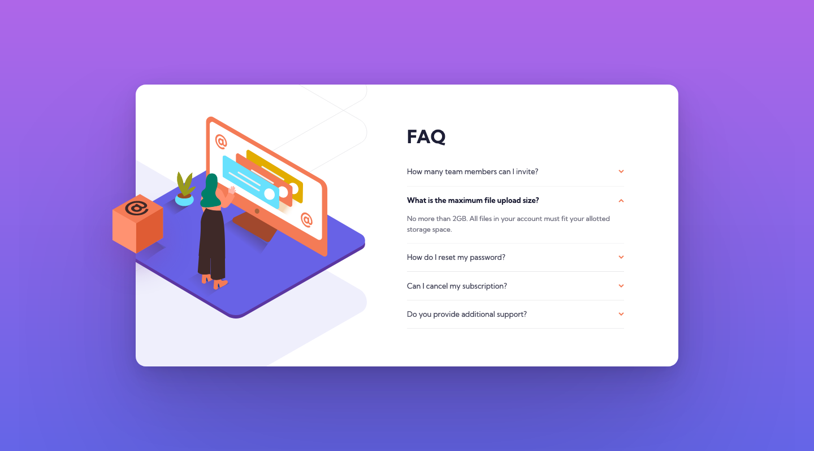

# Frontend Mentor - FAQ accordion card solution

This is a solution to the [FAQ accordion card challenge on Frontend Mentor](https://www.frontendmentor.io/challenges/faq-accordion-card-XlyjD0Oam). Frontend Mentor challenges help you improve your coding skills by building realistic projects. 

## Table of contents

- [Overview](#overview)
  - [The challenge](#the-challenge)
  - [Screenshot](#screenshot)
  - [Links](#links)
- [My process](#my-process)
  - [Built with](#built-with)
  - [What I learned](#what-i-learned)
  - [Continued development](#continued-development)
  - [Useful resources](#useful-resources)
- [Author](#author)

## Overview

### The challenge

Users should be able to:

- View the optimal layout for the component depending on their device's screen size
- See hover states for all interactive elements on the page
- Hide/Show the answer to a question when the question is clicked

### Screenshot

#### Desktop


_(1440×800px)_

#### Mobile


_(375×768px)_

### Links

- [Solution Repository URL](https://github.com/hyde-brendan/hyde-brendan.github.io/tree/main/frontend-mentor/faq-accordion-card)
- [Live Site URL](https://hyde-brendan.github.io/frontend-mentor/faq-accordion-card/index)

## My process

### Built with

- Semantic HTML5 markup
- CSS custom properties
- CSS Grid
- Mobile-first workflow

### What I learned

I was originally going to start this challenge sooner, but since this would be my first Frontend Mentor project involving JavaScript, I figured I should at minimum learn a little prerequisite information. I wound up doing the entirety of [Per Harald Borgen's basics to JavaScript course on Scrimba](https://scrimba.com/learn/learnjavascript)—recommend if you happen to not know anything about JavaScript—which didn't exactly apply too much in regards to building a functional FAQ accordion, *but* would give me a fair bit of useful fundamentals to understand the *actual* guide I referred to for this.

The JavaScript for this was actually quite minimal; the primary role was to add event listeners to each of the tabs that would cause them to expand and show the answer. That was easily done just with a loop and `container.classList.toggle("active")` function. However, I found that the full height of all the answers being expanded would cause issues with the image layouts (talked about below), and as such had to change it so only one tab could be open at any given time. Thankfully, this too was pretty simple, involving all other active tabs besides the one clicked to lose their `active` CSS class:

```javascript
const activeAccordion = document.querySelectorAll("div.container.active");
for (let activeContainer of activeAccordion) {
    if (activeContainer !== container) activeContainer.classList.remove("active");
}
```

That said, the main roadblock I had with this project wasn't even the JavaScript, but rather figuring out (once again) how to wrangle the images to do what I wanted. While I'm sure there's numerous ways to tackle it, I ended up using `background-image` for the parts that did not overflow past the main card body, and a `position: absolute` pseudo-element for the parts that did, such as the "@" box.

The main associated challenges with that was fine-tuning the sizes of the container element as well as the values used for `background-position`. For example, take a quick look at the funky values for the desktop view:

```css
@media (min-width: 70em) {
    .card-hero {
        background-image: url(../images/illustration-woman-online-desktop.svg), url(../images/bg-pattern-desktop.svg);
        background-repeat: no-repeat, no-repeat;
        background-size: auto, auto;
        background-position: right -490% top 40%, right -10% top 65%;
        width: 120%;
        max-width: none;
        aspect-ratio: 46 / 50;
    }
}
```

One caveat with that can be see with the mobile-to-desktop breakpoint being so high was simply due to the images on the desktop side completely breaking if the main card wasn't at its maximum width.

### Continued development

The primary feature I would like to add to this project in the future is a functional wipe animation for opening and closing the accordion tabs. The main issue with that was if you didn't want to do it with JavaScript yet (like I didn't due to my limited experience), you'd have to use less-than optimal methods, such as:

- `max-height` with an explicit value (which both doesn't work with the variable number of lines the answers have, and an awkward delay for the animation to reach the content)
- `scaleY()` (which, instead of the desired wipe effect, visibly scrunches up all the content in this yucky manner)

### Useful resources

- [Kingsley Ubah's accordion tutorial](https://www.freecodecamp.org/news/build-an-accordion-menu-using-html-css-and-javascript/) - The guide I referred to for building a functional accordion pattern with JavaScript.
- [CSS Tricks' article on animating variable dimensions](https://css-tricks.com/using-css-transitions-auto-dimensions/) - While I didn't actually use this, they talk about the issues with non-JavaScript-based accordion animation. I would like to check out the various JavaScript solutions done both in the article proper as well as the comment section.

## Author

- Frontend Mentor - [@hyde-brendan](https://www.frontendmentor.io/profile/hyde-brendan)