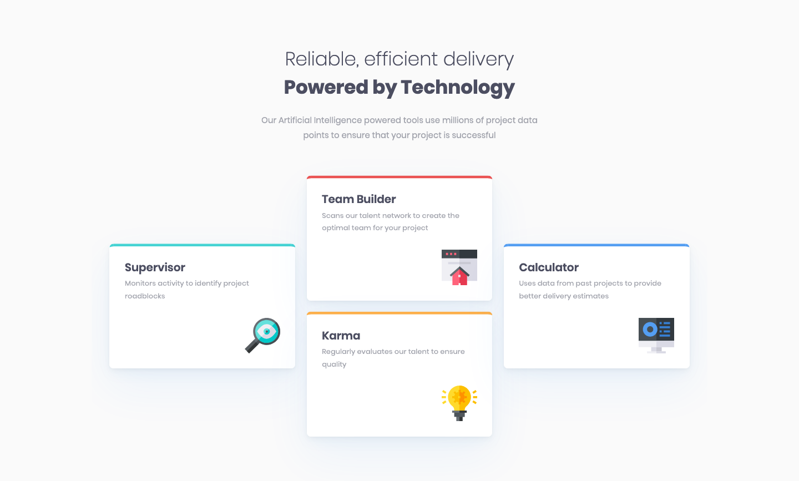
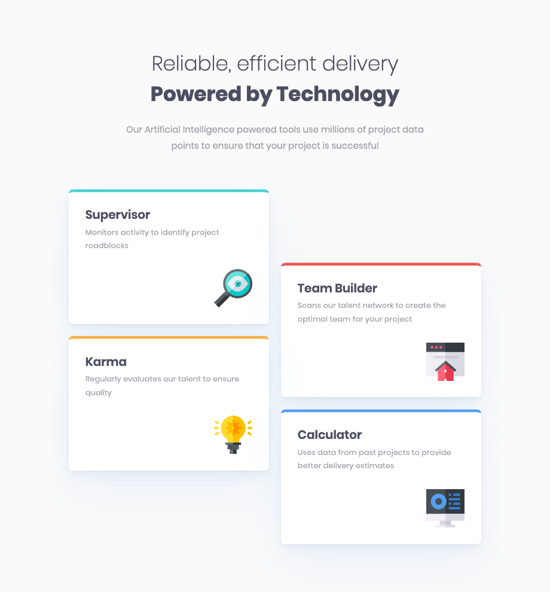
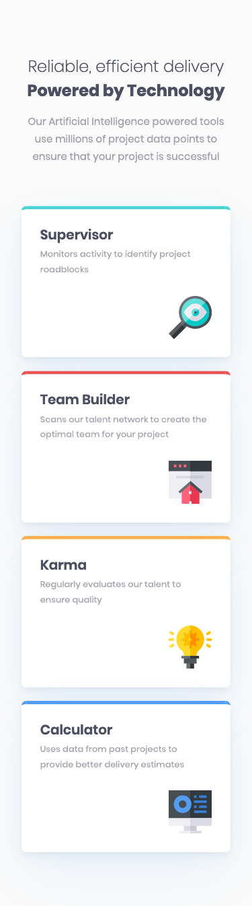

# Frontend Mentor - Four card feature section solution

This is a solution to the [Four card feature section challenge on Frontend Mentor](https://www.frontendmentor.io/challenges/four-card-feature-section-weK1eFYK). Frontend Mentor challenges help you improve your coding skills by building realistic projects. 

## Table of contents

- [Overview](#overview)
  - [The challenge](#the-challenge)
  - [Screenshot](#screenshot)
  - [Links](#links)
- [My process](#my-process)
  - [Built with](#built-with)
  - [What I learned](#what-i-learned)
  - [Continued development](#continued-development)
  - [Useful resources](#useful-resources)
- [Author](#author)

## Overview

### The challenge

Users should be able to:

- View the optimal layout for the site depending on their device's screen size

### Screenshot

#### Desktop

_(1440×867px)_

#### Tablet

_(920×990px)_

#### Mobile

_(375×1347px)_

### Links

- [Solution Repository URL](https://github.com/hyde-brendan/hyde-brendan.github.io/tree/main/frontend-mentor/four-card-feature-section)
- [Live Site URL](https://hyde-brendan.github.io/frontend-mentor/four-card-feature-section/index)

## My process

### Built with

- Semantic HTML5 markup
- CSS custom properties
- CSS Grid
- Mobile-first workflow

### What I learned

Not too learnt on this particular challenge, just a nice and simple practice reinforcing my knowledge on using `grid-template-areas` to cool down after the kinda frustrating time I had with the tooltip for the [Article preview component challenge](https://github.com/hyde-brendan/hyde-brendan.github.io/tree/main/frontend-mentor/article-preview-component). I even added a tablet layout for the cards, and little `scale()` animation when hovering over a card!

### Continued development

Originally when I was adding the `:hover` animation, I wanted a neat effect where the colored outline on top would wipe around the card for a full colored outline, but chose against it because I didn't have a clean solution for adjusting for the padding change, or because I didn't exactly know how to do it; would it be something like setting delays for a continuous stroke? How would it start from one end?

I'd like to play around with that in the future.

### Useful resources

- [CSS Tricks' "A Complete Guide to CSS Grid"](https://css-tricks.com/snippets/css/complete-guide-grid/) - Always a helpful cheatsheet for remembering the properties usable for `grid`, such as remembering the difference between justify and align.

## Author

- Frontend Mentor - [@hyde-brendan](https://www.frontendmentor.io/profile/hyde-brendan)