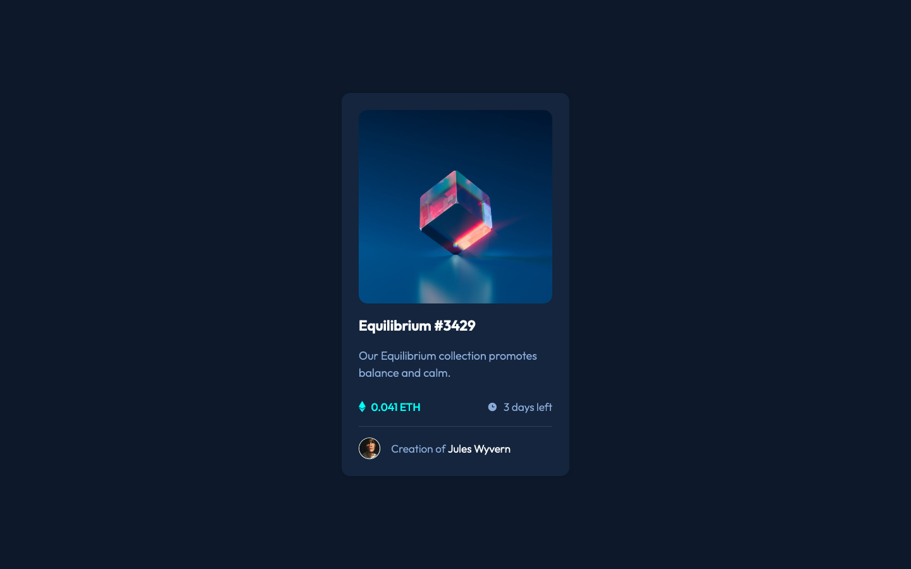

# Frontend Mentor - NFT preview card component solution

This is a solution to the [NFT preview card component challenge on Frontend Mentor](https://www.frontendmentor.io/challenges/nft-preview-card-component-SbdUL_w0U). Frontend Mentor challenges help you improve your coding skills by building realistic projects. 

## Table of contents

- [Overview](#overview)
  - [The challenge](#the-challenge)
  - [Screenshots](#screenshots)
  - [Links](#links)
- [My process](#my-process)
  - [Built with](#built-with)
  - [What I learned](#what-i-learned)
  - [Continued development](#continued-development)
  - [Useful resources](#useful-resources)
- [Author](#author)

## Overview

### The challenge

Users should be able to:

- View the optimal layout depending on their device's screen size
- See hover states for interactive elements

### Screenshots

#### Desktop

_(1440×900px)_

#### Mobile

_(375×667px)_

### Links

- [Solution Repository URL](https://github.com/hyde-brendan/hyde-brendan.github.io/tree/main/frontend-mentor/nft-preview-card-component)
- [Live Site URL](https://hyde-brendan.github.io/frontend-mentor/nft-preview-card-component/index)

## My process

### Built with

- CSS custom properties
- Flexbox & CSS Grid
- Mobile-first workflow

### What I learned

In this project, I took a closer look at pseudo elements, particularly `::before` and `::after` for drawing images like the SVG icons on the hover over the main image, as well as next to the cost and remaining time fields. One challenge was finding how to vertically align the icons to their paired texts; declaring the main element with `display: flex;` with `align-items: center;`, and then setting the SVG as a block-level element was my solution.

Beyond that though, this project mostly consisted of fine-tuning the CSS to best match the provided design. I'm very happy with how it turned out!

### Continued development

I'm curious if there are more preferable practices to how to manipulate images, both as pseudo elements as well as absolute position (as was the case with the eye icon when hovering over the main image).

### Useful resources

- [Manisha Basra's article on centering elements with CSS](https://medium.com/front-end-weekly/absolute-centering-in-css-ea3a9d0ad72e) - The article that helped me with dealing with aligning the icons used in this project.

## Author

- Frontend Mentor - [@hyde-brendan](https://www.frontendmentor.io/profile/hyde-brendan)
