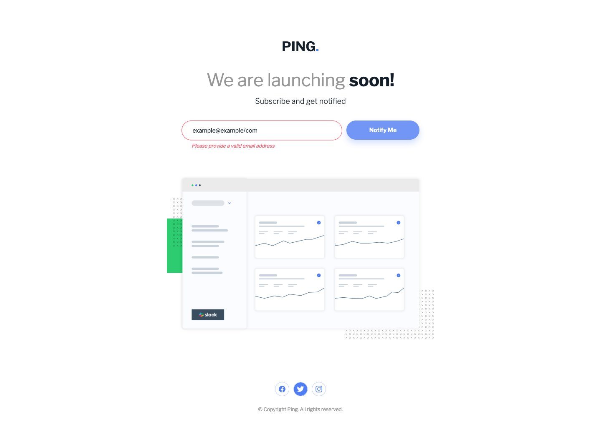
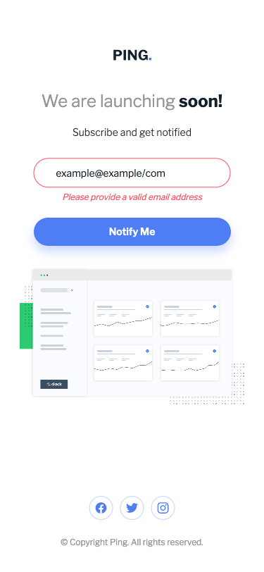

# Frontend Mentor - Ping coming soon page solution

This is a solution to the [Ping coming soon page challenge on Frontend Mentor](https://www.frontendmentor.io/challenges/ping-single-column-coming-soon-page-5cadd051fec04111f7b848da). Frontend Mentor challenges help you improve your coding skills by building realistic projects. 

## Table of contents

- [Overview](#overview)
  - [The challenge](#the-challenge)
  - [Screenshot](#screenshot)
  - [Links](#links)
- [My process](#my-process)
  - [Built with](#built-with)
  - [What I learned](#what-i-learned)
  - [Continued development](#continued-development)
  - [Useful resources](#useful-resources)
- [Author](#author)

## Overview

### The challenge

Users should be able to:

- View the optimal layout for the site depending on their device's screen size
- See hover states for all interactive elements on the page
- Submit their email address using an `input` field
- Receive an error message when the `form` is submitted if:
	- The `input` field is empty. The message for this error should say *"Whoops! It looks like you forgot to add your email"*
	- The email address is not formatted correctly (i.e. a correct email address should have this structure: `name@host.tld`). The message for this error should say *"Please provide a valid email address"*

### Screenshot

#### Desktop



_(1440×1024px)_

#### Mobile



_(375×812px)_

### Links

- [Solution Repository URL](https://github.com/hyde-brendan/hyde-brendan.github.io/tree/main/frontend-mentor/ping-coming-soon-page)
- [Live Site URL](https://hyde-brendan.github.io/frontend-mentor/ping-coming-soon-page/index)

## My process

### Built with

- Semantic HTML5 markup
- CSS custom properties
- Flexbox & CSS Grid
- Mobile-first workflow

### What I learned

Got the chance to try out a few new things in this challenge:

- For once, I had content outside of just a single `<main>` element, with the logo being placed in a `<header>` element and both the social media links and the copyright message in a `<footer>` element. Thankfully, it didn't change too much besides having to specify the row sizes on the `body` centering grid so the header and footer weren't taking up a third of the page space each.
- This challenge did not include the SVGs for the social media icons this time, necessitating the need to use a font icon library. It's pretty clear that the design uses the ones from [Font Awesome](https://fontawesome.com/), but after testing some out, I felt that [Ionicons](https://ionic.io/ionicons) were the easiest to quickly set up without having to create any accounts or download any additional files. You can just import the set like a Google Font and get access to the `<ion-icon>` element:

```html
<!-- In <footer> -->
<div class="sites">
    <a href="#" target="_blank" class="site">
        <ion-icon name="logo-facebook"></ion-icon>
    </a>
    <a href="#" target="_blank" class="site">
        <ion-icon name="logo-twitter"></ion-icon>
    </a>
    <a href="#" target="_blank" class="site">
        <ion-icon name="logo-instagram"></ion-icon>
    </a>
</div>
<script type="module" src="https://unpkg.com/ionicons@5.5.2/dist/ionicons/ionicons.esm.js"></script>
<script nomodule src="https://unpkg.com/ionicons@5.5.2/dist/ionicons/ionicons.js"></script>
```

- One of the first thing I noticed with the design was that the dashboard illustration did not shift down when the invalid email message popped up. I had a couple potential ideas that could work for that, but the one I ended up settling for involves setting a negative `margin-top` whose value is 0 when the error message isn't there, and the sum of the vertical space created when it is. It's not even as bad as it sounds, it just requires some trial-and-error:

```css
.hero.invalid {
    margin-top: calc( ( var(--fs-300) + 1.5em ) * -1 );
}
```

- Finally I got the chance to use JavaScript to change the content of a HTML element (in this case, the error message based on if the input was an empty string or an invalid email address). Again, pretty simple to do, and I did consider the difference between [`innerHTML`](https://developer.mozilla.org/en-US/docs/Web/API/Element/innerHTML) and [`innerText`](https://developer.mozilla.org/en-US/docs/Web/API/HTMLElement/innerText), I just went with the latter since the error message has no children:

```javascript
let errorMsg = emailValue.trim() === "" ?
    `Whoops! It looks like you forgot to add your email` :
    `Please provide a valid email address`;
inputEl.lastElementChild.innerHTML = errorMsg;
```

### Continued development

I think I'd be neat if there was some confirmation that the inputted email address would be successfully added to the mailing list, such as a popup card notification, maybe with a cute animation.

## Author

- Frontend Mentor - [@hyde-brendan](https://www.frontendmentor.io/profile/hyde-brendan)