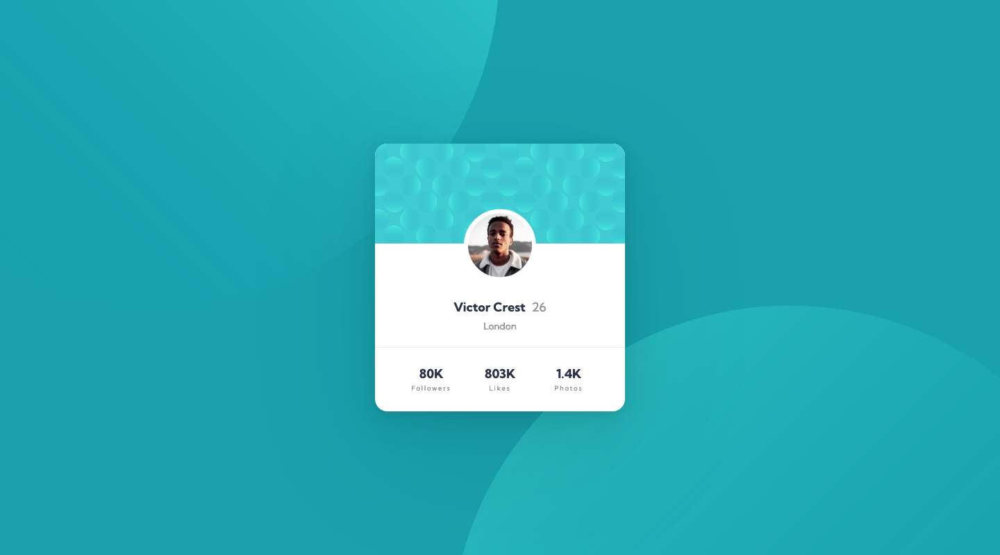
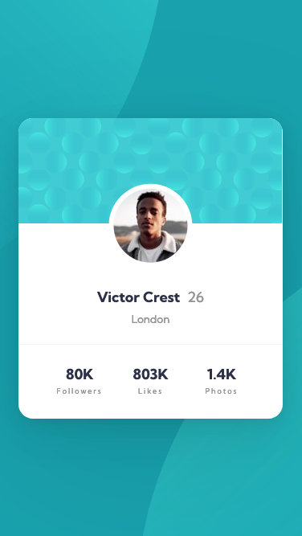

# Frontend Mentor - Profile card component solution

This is a solution to the [Profile card component challenge on Frontend Mentor](https://www.frontendmentor.io/challenges/profile-card-component-cfArpWshJ). Frontend Mentor challenges help you improve your coding skills by building realistic projects. 

## Table of contents

- [Overview](#overview)
  - [The challenge](#the-challenge)
  - [Screenshot](#screenshot)
  - [Links](#links)
- [My process](#my-process)
  - [Built with](#built-with)
  - [What I learned](#what-i-learned)
  - [Continued development](#continued-development)
  - [Useful resources](#useful-resources)
- [Author](#author)

## Overview

### The challenge

- Build out the project to the designs provided

### Screenshot

#### Desktop


_(1440×800px)_

#### Mobile


_(375×667px)_

### Links

- [Solution Repository URL](https://github.com/hyde-brendan/hyde-brendan.github.io/tree/main/frontend-mentor/profile-card-component)
- [Live Site URL](https://hyde-brendan.github.io/frontend-mentor/profile-card-component/index)

## My process

### Built with

- CSS custom properties
- Flexbox & CSS Grid
- Mobile-first workflow

### What I learned

This challenge wasn't especially notable in terms of new content, but I did have to go out and learn how multiple `background-image` work for the circular patterns on the background.

Aside from that, my normal way of setting the component's width with just `max-width` did not work with this project due to the content not naturally stretching out to the mobile layout's inline padding. As such, I had to utilize a hack:

```css
.main-content {
    width: min(87.5vw, 22.5rem);
}
```

### Continued development

Curious if there's a better way of addressing the component width hack mentioned above!

### Useful resources

- [MDN Web Docs' page on multiple background elements](https://developer.mozilla.org/en-US/docs/Web/CSS/CSS_Backgrounds_and_Borders/Using_multiple_backgrounds)

## Author

- Frontend Mentor - [@hyde-brendan](https://www.frontendmentor.io/profile/hyde-brendan)