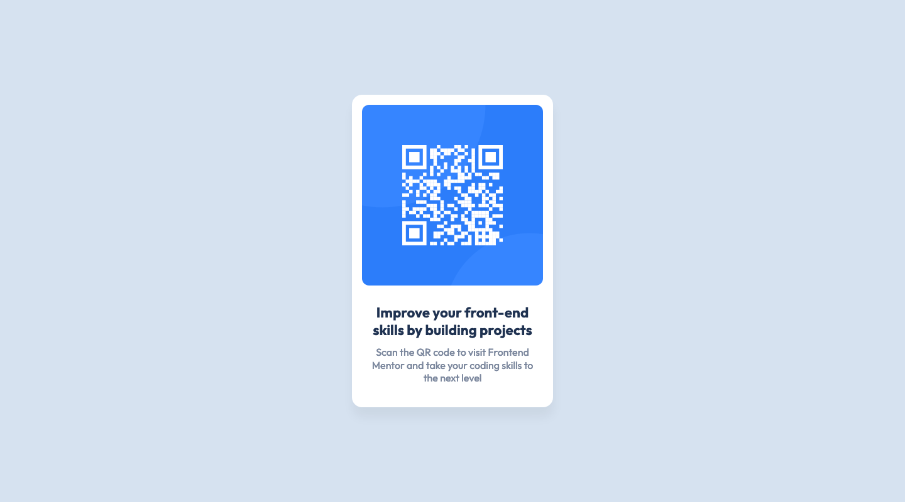

# Frontend Mentor - QR code component solution

This is a solution to the [QR code component challenge on Frontend Mentor](https://www.frontendmentor.io/challenges/qr-code-component-iux_sIO_H). Frontend Mentor challenges help you improve your coding skills by building realistic projects. 

## Table of contents

- [Overview](#overview)
  - [Screenshot](#screenshot)
  - [Links](#links)
- [My process](#my-process)
  - [Built with](#built-with)
  - [What I learned](#what-i-learned)
  - [Continued development](#continued-development)
- [Author](#author)

## Overview

### Screenshot

#### Desktop

_(1440×800px)_

#### Mobile

_(375×667px)_

### Links

- [Solution Repository URL](https://github.com/hyde-brendan/hyde-brendan.github.io/tree/main/frontend-mentor/qr-code-component)
- [Live Site URL](https://hyde-brendan.github.io/frontend-mentor/qr-code-component/index)

## My process

### Built with

- Semantic HTML5 markup
- CSS custom properties
- Mobile-first workflow

### What I learned

Since this was added while I was already halfway through all the Newbie-level challenges, I didn't get around to doing this until now, as the final (free) challenge I had yet to complete. I'll be moving along onto the Junior-level challenges next.

Obviously this particular challenge would be a pretty quick one, only taking me around 20 minutes to do. As such I didn't really learn anything new, just tried to reinforce things like on-hover animation and semantic HTML markup.

### Continued development

*N/A*

## Author

- Frontend Mentor - [@hyde-brendan](https://www.frontendmentor.io/profile/hyde-brendan)