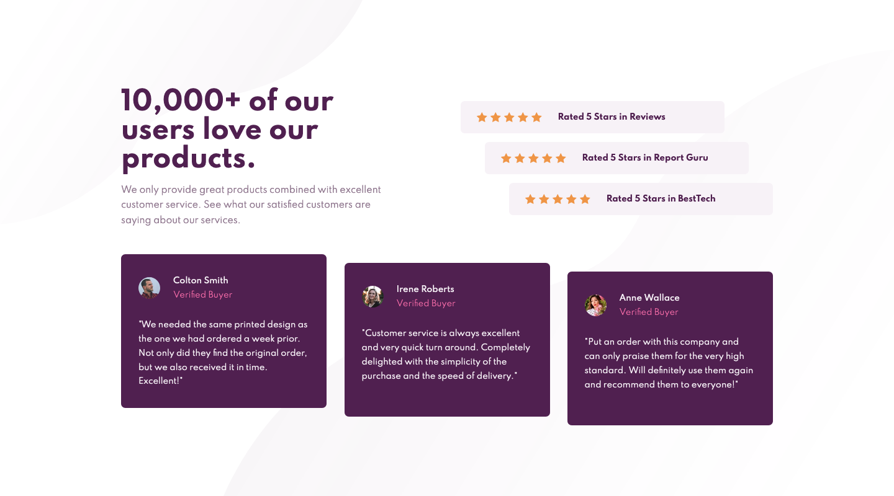
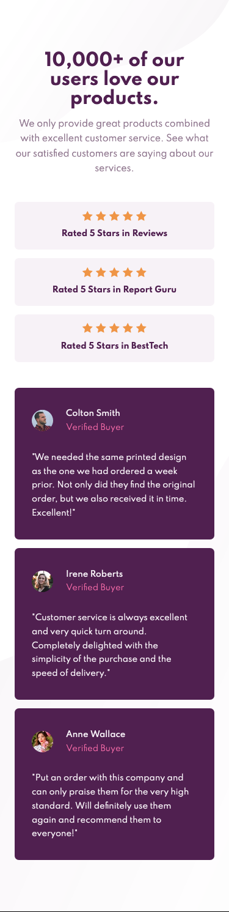
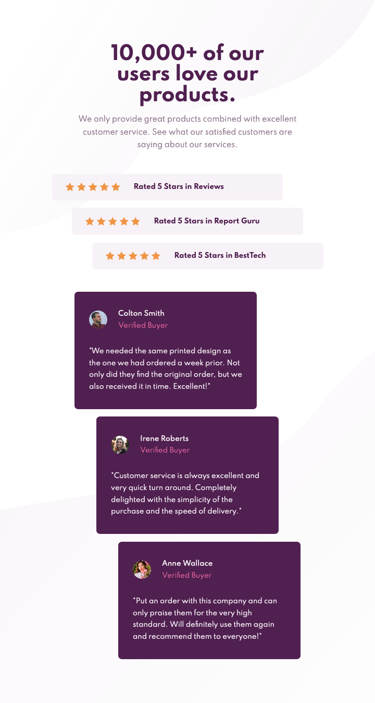

# Frontend Mentor - Social proof section solution

This is a solution to the [Social proof section challenge on Frontend Mentor](https://www.frontendmentor.io/challenges/social-proof-section-6e0qTv_bA). Frontend Mentor challenges help you improve your coding skills by building realistic projects. 

## Table of contents

- [Overview](#overview)
  - [The challenge](#the-challenge)
  - [Screenshot](#screenshot)
  - [Links](#links)
- [My process](#my-process)
  - [Built with](#built-with)
  - [What I learned](#what-i-learned)
  - [Continued development](#continued-development)
  - [Useful resources](#useful-resources)
- [Author](#author)

## Overview

### The challenge

Users should be able to:

- View the optimal layout for the section depending on their device's screen size

### Screenshot

#### Desktop


_(1440×800px)_

#### Mobile


_(375×1491px)_

### Links

- [Solution Repository URL](https://github.com/hyde-brendan/hyde-brendan.github.io/tree/main/frontend-mentor/social-proof-section)
- [Live Site URL](https://hyde-brendan.github.io/frontend-mentor/social-proof-section/index)

## My process

### Built with

- Semantic HTML5 markup
- CSS custom properties
- Flexbox & CSS Grid
- Mobile-first workflow

### What I learned

This project's primary focus was on the manipulation of Flexbox and Grid, but thankfully I had some good prior practice with it before. The mobile section in fact went by extremely smoothly with no real complications; I just used a simple grid stack using `grid-area`.

The most notable feature in this design's desktop view are the slight offsets on each of the rating and review cards; my initial idea for these was to lengthen the container for the sections, and then set the flex alignment accordingly. The idea was that it would allow for more dynamic spacing based on the screen size, but unfortunately when trying it with the ratings, I ran into issues getting the width of the individual cards to be different from the container to work like I'd want. In the end, I instead used `transform: translate()` to shift each card for the desired effect. This method also worked fine! I just had to slightly increase the breakpoint to desktop view so the ratings didn't cut into the text to its left.

Besides that, I wanted to try out a simple JavaScript function to handle the repetitive rendering of the star vectors for the ratings:
```javascript
const starsEl = document.querySelectorAll("div.stars");
renderStars();

function renderStars(numStars = 5) {
    for (let el of starsEl) {
        let html = "";
        for (let i = 0; i < numStars; i++) {
            html += ``;
        }

        el.innerHTML = html;
    }
}
```

In a real scenario, the implementation would have to be completely different as you'd want each card to have a different number of stars, as well as the potential of partially cut stars for decimal ratings.

### Continued development

To help fill up dead space between the mobile and desktop views, I made a very basic tablet layout with the offsets on the rating and review cards:



While this works fine enough for the purposes of this challenge, I do wonder how I could improve the layout of the tablet view further.

Additionally, I discussed the `renderStars()` function potentially featuring support for partially cut stars for decimal values, but I doubt I could accomplish that with my current level of JavaScript knowledge. That's and idea for the future!

### Useful resources

- [Kevin Powell's stream of him tackling this same challenge](https://youtu.be/K27WULzr2P8) - I happened to watch this a few weeks back, but didn't refer to it at all when I was working on this project. Regardless, I would recommend giving it a watch, and Kevin's solutions may have influenced my own.

## Author

- Frontend Mentor - [@hyde-brendan](https://www.frontendmentor.io/profile/hyde-brendan)