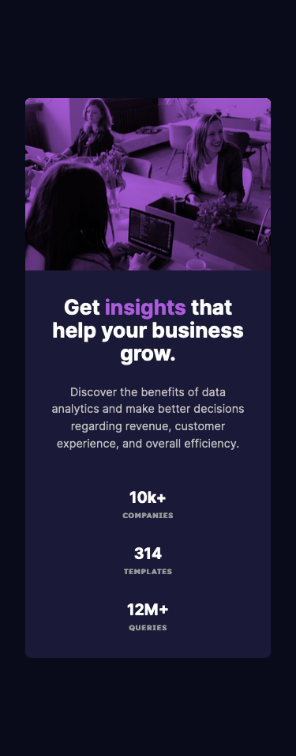

# Frontend Mentor - Stats preview card component solution

This is a solution to the [Stats preview card component challenge on Frontend Mentor](https://www.frontendmentor.io/challenges/stats-preview-card-component-8JqbgoU62). Frontend Mentor challenges help you improve your coding skills by building realistic projects. 

## Table of contents

- [Overview](#overview)
  - [The challenge](#the-challenge)
  - [Screenshots](#screenshots)
  - [Links](#links)
- [My process](#my-process)
  - [Built with](#built-with)
  - [What I learned](#what-i-learned)
  - [Continued development](#continued-development)
  - [Useful resources](#useful-resources)
- [Author](#author)

## Overview

### The challenge

Users should be able to:

- View the optimal layout depending on their device's screen size

### Screenshots

#### Desktop


_(1440×800px)_

#### Mobile


_(375×956px)_

### Links

- [Solution Repository URL](https://github.com/hyde-brendan/hyde-brendan.github.io/tree/main/frontend-mentor/stats-preview-card-component)
- [Live Site URL](https://hyde-brendan.github.io/frontend-mentor/stats-preview-card-component/index)

## My process

### Built with

- Semantic HTML5 markup
- CSS custom properties
- Flexbox & CSS Grid
- Mobile-first workflow

### What I learned

This Frontend Mentor project was the first non-guided project I completed. Beyond simply replicating the layout exactly, I wanted to try out a few different CSS properties I had discovered while browsing in the past.

The most glaring example is the image; I'm assuming the provided design used a semi-transparent colored block placed on top of the image, whereas I wanted to try out the [`background-blend-mode`](https://developer.mozilla.org/en-US/docs/Web/CSS/background-blend-mode) property:

```css
.content-image {
    grid-area: image;
    background-image: url(../images/image-header-mobile.jpg);
    background-size: cover;
    width: 100%;
    aspect-ratio: 1 / 0.7;
    background-color: var(--clr-primary-light);
    background-blend-mode: multiply;
}
```

The result compared to the original design is less washed out, so I'm happy with how it turned out.

Aside from `background-blend-mode`, I played around with various other stuff that proved valuable learning experience, including:
- Aligning main content using `display flex; align-items: center; justify-content: center;`
- CSS variables
- `clamp()` for font sizes and padding
- Grids with `grid-template-areas`

### Continued development

Many of the properties I experimented with for this project I will no doubt continue to use going forth. In the future, I would like to practice more with is `clamp()` for font sizes, particularly how to best pick the preferred variable, as well as more involved grid layouts.

One other question I was unable to solve while creating this was if there exists a way to counteract padding specifically for a single element (the image). If I could, then much of my padding elsewhere could be removed.

### Useful resources

- [CSS-Tricks' article on blend modes](https://css-tricks.com/basics-css-blend-modes/) - My first exposure to `background-blend-mode`. The article includes various other parts that would be very fun to try out in the future.

## Author

- Frontend Mentor - [@hyde-brendan](https://www.frontendmentor.io/profile/hyde-brendan)
