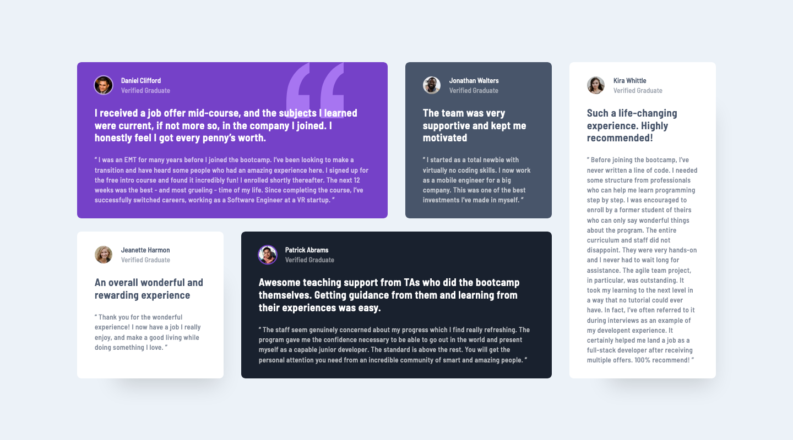

# Frontend Mentor - Testimonials grid section solution

This is a solution to the [Testimonials grid section challenge on Frontend Mentor](https://www.frontendmentor.io/challenges/testimonials-grid-section-Nnw6J7Un7). Frontend Mentor challenges help you improve your coding skills by building realistic projects. 

## Table of contents

- [Overview](#overview)
  - [The challenge](#the-challenge)
  - [Screenshot](#screenshot)
  - [Links](#links)
- [My process](#my-process)
  - [Built with](#built-with)
  - [What I learned](#what-i-learned)
  - [Continued development](#continued-development)
  - [Useful resources](#useful-resources)
- [Author](#author)

## Overview

### The challenge

Users should be able to:

- View the optimal layout for the site depending on their device's screen size

### Screenshot

#### Desktop

_(1440×800px)_

#### Mobile

_(375×2068px)_

### Links

- [Solution Repository URL](https://github.com/hyde-brendan/hyde-brendan.github.io/tree/main/frontend-mentor/testimonials-grid-section)
- [Live Site URL](https://hyde-brendan.github.io/frontend-mentor/testimonials-grid-section/index)

## My process

### Built with

- Semantic HTML5 markup
- CSS custom properties
- Flexbox & CSS Grid
- Mobile-first workflow

### What I learned

Considering I've been using CSS Grid for nearly all my previous solutions, a challenge focusing on using grids was pretty simple for me. Nothing too notable for me to talk about this time!

### Continued development

You may notice that there's a simple scale effect whenever you hover over a card. I actually wanted to make it skew slightly to achieve a 3D effect, but I wasn't really sure how to do it. Attempts just looked off to me, so I decided to put it off for now.

### Useful resources

- [Kevin Powell's 'Learn CSS Grid the easy way' video](https://www.youtube.com/watch?v=rg7Fvvl3taU) - For a generalized introduction to CSS grid, Kevin uses this specific Frontend Mentor challenge to show how to use grid to achieve the layout of this design. I didn't use it for this, but I have watched the video in the past, and I highly recommend it if you're new to CSS grid.

## Author

- Frontend Mentor - [@hyde-brendan](https://www.frontendmentor.io/profile/hyde-brendan)
