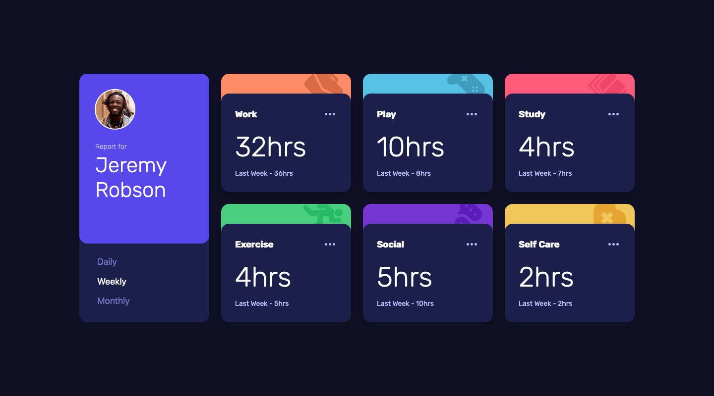
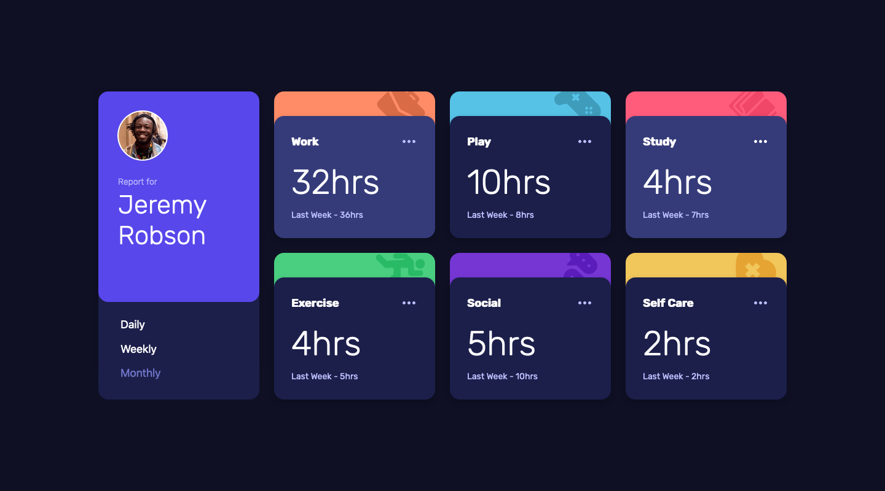
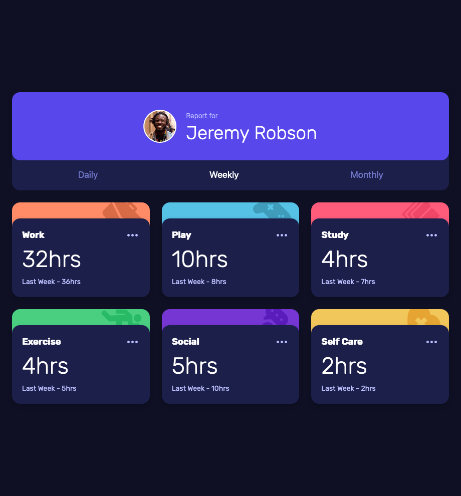
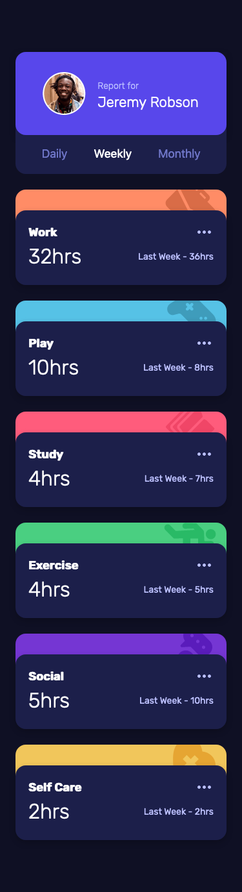

# Frontend Mentor - Time tracking dashboard solution

This is a solution to the [Time tracking dashboard challenge on Frontend Mentor](https://www.frontendmentor.io/challenges/time-tracking-dashboard-UIQ7167Jw). Frontend Mentor challenges help you improve your coding skills by building realistic projects. 

## Table of contents

- [Overview](#overview)
  - [The challenge](#the-challenge)
  - [Screenshot](#screenshot)
  - [Links](#links)
- [My process](#my-process)
  - [Built with](#built-with)
  - [What I learned](#what-i-learned)
  - [Continued development](#continued-development)
  - [Useful resources](#useful-resources)
- [Author](#author)

## Overview

### The challenge

Users should be able to:

- View the optimal layout for the site depending on their device's screen size
- See hover states for all interactive elements on the page
- Switch between viewing Daily, Weekly, and Monthly stats

### Screenshot

#### Desktop



_(1440×800px)_

#### Tablet


_(920×990px)_

#### Mobile


_(375×1374px)_

### Links

- [Solution Repository URL](https://github.com/hyde-brendan/hyde-brendan.github.io/tree/main/frontend-mentor/time-tracking-dashboard)
- [Live Site URL](https://hyde-brendan.github.io/frontend-mentor/time-tracking-dashboard/index)

## My process

### Built with

- Semantic HTML5 markup
- CSS custom properties
- Flexbox & CSS Grid
- Mobile-first workflow

### What I learned

This was my first Junior-level challenge, and it was a bit of a step in difficulty compared to most of the Newbie-level challenges. This particular challenge focused on three things: how you would create the two-layer cards; how you would set up the grid for the cards, and how you would make the Daily/Weekly/Monthly buttons functional.

Prior to starting the challenge, I was messing around on CodePen to figure out how to handle the two-layer card. My initial idea was to use `grid` for it: I know from the ["Base Apparel coming soon page" challenge](https://github.com/hyde-brendan/hyde-brendan.github.io/tree/main/frontend-mentor/base-apparel-coming-soon-page) that grid elements will overlap if explicitly set to the same spot. If I set the back card to rows 1 and 2, and the front card to rows 2 and 3, and *both* to column 1, then the cards should overlap how I want them to. You can take a look at how it turned out in the [aforementioned CodePen]("https://codepen.io/hyde-brendan/pen/dyZRqQB"). It actually works quite nicely, but I personally found it troublesome to work with. The final solution instead uses a pseudo element to draw the back card. It was comparatively easier to work with, though at a cost discussed later.

The grid to lay out the cards was very simple. This solution actually uses two types of grids: the `.main-grid` for all the cards, and a `.card` grid for the stats of each card's topic. While I thought about using `grid-auto-flow` for this, using auto flow is primarily designed for when you don't know how many elements you're going to have for the grid, and I was having trouble wrangling it in preliminary experiments, so I settled for media query breaks instead. In total there's 3 break points (`min-width: 32.5em`, `min-width: 50em`, and `min-width: 65em`) for a total of 1 mobile view, 1 desktop view, and 2 tablet views.

The final topic of note is the JavaScript for this challenge. While I have a fair bit of experience with JSON and was able to change the DOM element values based on the contents of `data.json` pretty easily, I was less sure how to handle the button changing focus to what was last clicked. Because that type of behavior matches buttons to show different tabs, I started from there, and pieced together a method not long after.

On each of the `<button>` elements, I added the `role`, `tabindex` and `aria-selected` attributes:
```html
<section class="user-card--bottom">
    <button class="sort--daily" role="tab" tabindex="1" aria-selected="false">Daily</button>
    <button class="sort--weekly" role="tab" tabindex="2" aria-selected="true">Weekly</button>
    <button class="sort--monthly" role="tab" tabindex="3" aria-selected="false">Monthly</button>
</section>
```

Then, in the the JavaScript script I used `querySelectorAll()` to get all the button elements, then added a click event listener to each. Since it would be unnecessary to reload the contents with the same data if you click the currently selected button, I add a check to ensure the clicked button's `aria-selected` is false. From there, the function falsifies the `aria-selected` of the button with it true, and sets it to true on the clicked button instead:
```javascript
sortBtns.forEach(sortBtn => {
    sortBtn.addEventListener("click", () => {
        if (sortBtn.getAttribute("aria-selected") === "false") {
            // Swap selected button focus
            document.querySelector("[aria-selected='true']").setAttribute("aria-selected", false);
            sortBtn.setAttribute("aria-selected", true);

            // Update all stat card values
            updateStatCardValues(sortBtn.getAttribute("tabindex"));
        }
    });
});
```

Finally, the `updateStatCardValues` function reads the JSON file and updates all the stat card's values to the selected button's domain. `tabindex` is used for switch statements to set whether to read from the daily, weekly, or monthly values.

### Continued development

I wanted to add a staggered animation of the cards all sliding in from the side. Unfortunately, I didn't know that CSS animation has the fun tendency to break any elements that use z-indexing for something – which becomes quite obviously apparent when you remember that I used pseudo elements to achieve the two-layer effect, complete with z-indexing. Because it's a `:before` element instead of a separate element, I can't use a separate keyframes animation where `z-index` is constantly set to -1 or 1. I tried to find a solution, but ultimately, I wasn't able to find anything useful, so I had to abandon the idea. If there's a way to do it without completely rewriting the card implementation, I'd love to hear it.

### Useful resources

- [MDN Web Docs' page on ARIA tab role](https://developer.mozilla.org/en-US/docs/Web/Accessibility/ARIA/Roles/tab_role) - The provided example on this page was my main resource in implementing the tab button functionality on my solution.

## Author

- Frontend Mentor - [@hyde-brendan](https://www.frontendmentor.io/profile/hyde-brendan)
